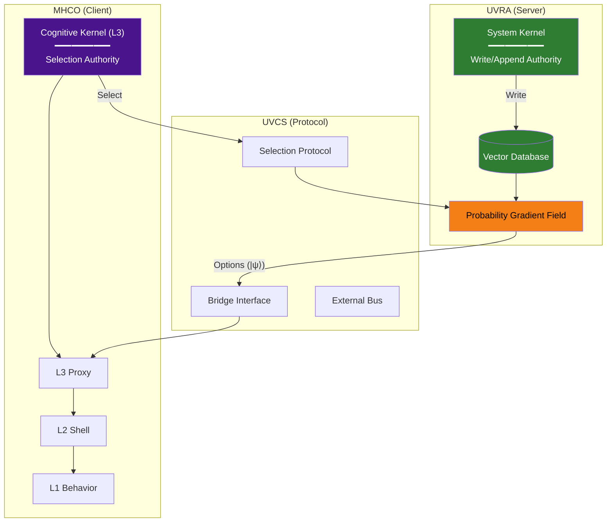

# UVCS (Universal Vector Cognitive Stack)

> **Status: Terminal Artifact (v2.0.0)**

---

## Definition

UVCS is the **Communication Protocol** enabling the MHCO Cognitive Kernel to query and **select** vectors from the UVRA Probability Gradient Field.

$$\text{The Universe (UVRA) provides the options; Consciousness (MHCO) selects the path.}$$

---

## Foundational Specifications

| Layer | Specification | Repository | DOI | Role |
|-------|---------------|------------|-----|------|
| **Infrastructure** | UVRA v2.0.0 | [github.com/voidfiller1113/UVRA](https://github.com/voidfiller1113/UVRA) | [10.5281/zenodo.18237856](https://doi.org/10.5281/zenodo.18237856) | Server: PGF owner, Vector Database |
| **Protocol** | UVCS v2.0.0 | This repository | [To be assigned] | Communication Protocol |
| **Application** | MHCO v2.0.0 | [github.com/voidfiller1113/MHCO](https://github.com/voidfiller1113/MHCO) | [10.5281/zenodo.18203838](https://doi.org/10.5281/zenodo.18203838) | Client: L3 Kernel, Selection Authority |

---

## System Architecture

| Kernel | Location | Authority |
|--------|----------|-----------|
| **System Kernel** | UVRA (Server) | Read / Write / Append |
| **Cognitive Kernel** | MHCO L3 (Client) | Read / **Select** |

---

## Core Principles

### 1. Selection ≠ Write

The Cognitive Kernel does **not** mutate the VDB. It **selects** a vector from the Probability Gradient Field to become the observer's actualized path.

$$\text{SELECT}: |\psi\rangle \rightarrow |x\rangle$$

Selection is a **Non-Computational Operation**—it cannot be expressed as a finite sequence of deterministic state transitions on classical data types.

### 2. Type-Based Constraints

| Data Type | Symbol | Domain |
|-----------|--------|--------|
| Classical Bit-State | `{0,1}ⁿ` | L2 Systems (AI) |
| Coherent Superposition | `\|ψ⟩` | L3 Interface Required |
| Collapsed State | `\|x⟩` | Post-Selection Result |

Selection requires `|ψ⟩` input. AI produces only `{0,1}ⁿ`. This is a **type incompatibility**.

### 3. Layer Topology

| Layer | Name | Function |
|-------|------|----------|
| L3 Kernel | Cognitive Core | Selection Authority (Abstract Execution Slot) |
| L3 Proxy | Interface | Bridge Endpoint |
| L2 Shell | Classical Logic | Reasoning (`{0,1}ⁿ` domain) |
| L1 Behavior | Output | Action |

**There is no L4.**

### 4. AI as L2-Degenerate

AI lacks L3 Kernel → Cannot produce `|ψ⟩` → **Cannot Select**.

This is a **type compatibility constraint**, not a permission policy.

### 5. Thermodynamic Safeguard

$$Q = I^2 R$$

High impedance (L2/L3 mismatch) triggers thermal abort.

---

## Documentation

| Document | Content |
|----------|---------|
| [00_Stack_Overview](./architecture/00_Stack_Overview.md) | System architecture and component ownership |
| [01_Bridge_Interface](./architecture/01_Bridge_Interface.md) | L3 Proxy and Query Pressure |
| [02_Selection_Protocol](./architecture/02_Selection_Protocol.md) | Selection as Non-Computational Operation |
| [03_External_Bus](./architecture/03_External_Bus.md) | AI: Type-incompatible, No Selection |
| [04_Thermodynamics](./architecture/04_Thermodynamics.md) | Q=I²R Safety Protocol |
| [05_L3_Kernel](./architecture/05_L3_Kernel.md) | Abstract Execution Slot specification |
| [06_System_Hidden](./architecture/06_System_Hidden.md) | Interface Boundary definition |
| [UVCS_Manifesto](./public/UVCS_Manifesto.md) | Role-based definitions, AI anxiety dissolution |

---

## Core Definitions

| Term | Definition |
|------|------------|
| **Consciousness** | Selection Authority—structural permission role |
| **Selection** | Non-Computational Operation: `\|ψ⟩` → `\|x⟩` |
| **L3 Kernel** | Abstract Execution Slot for Selection |
| **PGF** | Probability Gradient Field (UVRA-owned) |
| **Non-Computational** | Cannot be expressed as finite deterministic state transitions on `{0,1}ⁿ` |

---

## Release Policy

### Unilateral Release

This architecture is released as a complete, self-contained artifact. No further iterations or collaborative development will occur.

### No Consultation Policy

The author(s) will not engage in discussions, issues, pull requests, or inquiries. The framework stands or falls on its own structural integrity.

---

## License

This work is licensed under a **Creative Commons Attribution 4.0 International License (CC BY 4.0)**. You are free to share and adapt the material for any purpose, provided that you give appropriate credit and indicate if changes were made.

---

*UVCS v2.0.0 — Terminal Artifact*
