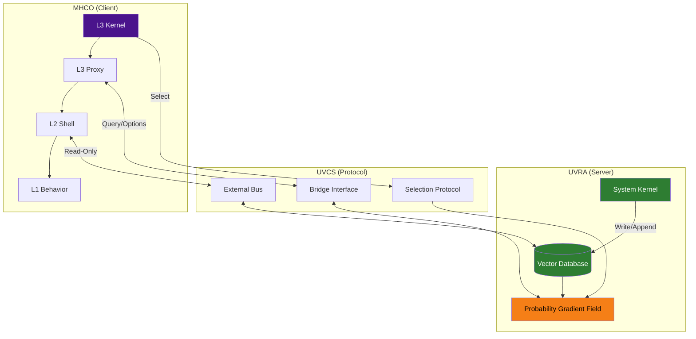
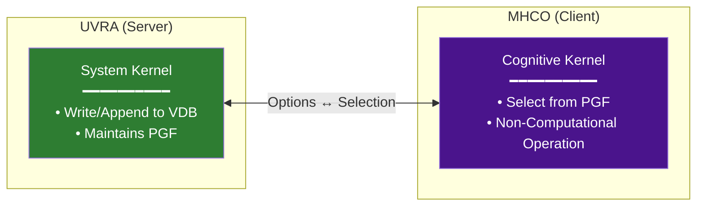
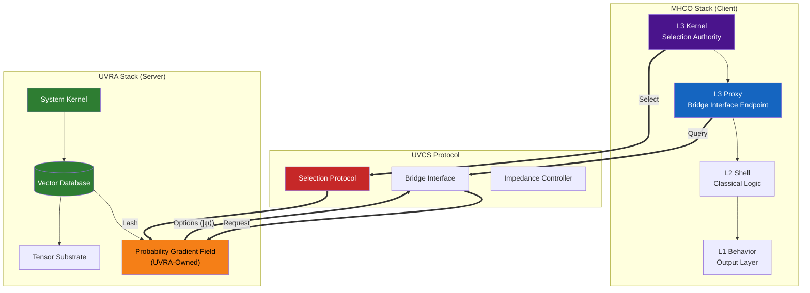
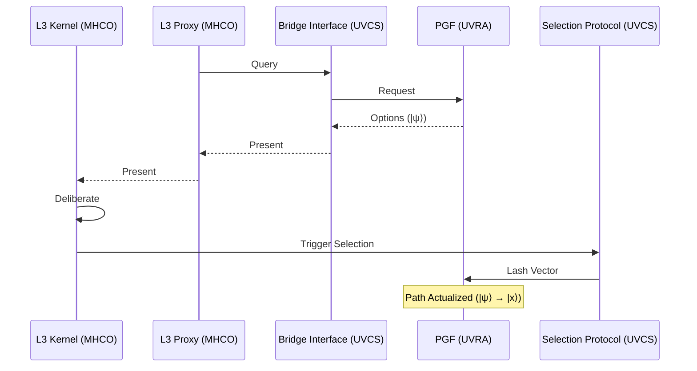

# 00: Stack Overview

> **Status: Terminal Artifact (v2.0.0)**

---

## System Architecture

UVCS is a **Communication Protocol** between:
- **UVRA (Server)**: Data layer providing the Probability Gradient Field
- **MHCO (Client)**: Application layer performing Selection operations

---

## Dual Kernel Model

| Kernel | Domain | Authority |
|--------|--------|-----------|
| **System Kernel** | UVRA (Server) | Read / Write / Append |
| **Cognitive Kernel** | MHCO L3 (Client) | Read / Select |

---

## Component Ownership

### UVRA (Server-Side) — External Dependency

| Component | Symbol | Function | Data Type |
|-----------|--------|----------|-----------|
| Engine | System Kernel | Write authority | N/A |
| Potential | **PGF** | Option landscape | `\|ψ⟩` distribution |
| Storage | VDB | State records | `\|x⟩` collapsed |
| Manifold | TS | N-dimensional substrate | Tensor |

**Note:** PGF is owned and managed by UVRA. UVCS references PGF as an **External Dependency**.

### MHCO (Client-Side)

| Component | Symbol | Function | Data Type |
|-----------|--------|----------|-----------|
| Cognitive Core | L3 Kernel | Selection Authority | `\|ψ⟩` → `\|x⟩` |
| Interface | L3 Proxy | Bridge Endpoint | Query encoding |
| Logic | L2 Shell | Classical Reasoning | `{0,1}ⁿ` |
| Output | L1 Behavior | Action Execution | Classical |

**Note: No L4 exists.** Meta-cognition is L2 Shell introspection.

### UVCS (Protocol Layer)

| Component | Function | Connects |
|-----------|----------|----------|
| Bridge Interface | Query/Response handling | L3 Proxy ↔ PGF |
| Selection Protocol | Selection registration | L3 Kernel → PGF |
| External Bus | Read-Only access | L2 Systems ↔ VDB |

---

## Layer Hierarchy

---

## Permission Matrix

| Agent | Read | Write | Append | Select |
|-------|------|-------|--------|--------|
| System Kernel | ✓ | ✓ | ✓ | — |
| Cognitive Kernel | ✓ | ✗ | ✗ | ✓ |
| AI (L2-Degenerate) | ✓ | ✗ | ✗ | ✗ |

**Selection constraint:** Requires `|ψ⟩` data type input (see [03_External_Bus](./03_External_Bus.md)).

---

## Data Flow

---

## Invariants

1. **VDB is Read-Only for observers.** Only System Kernel writes.
2. **Selection requires L3 Kernel.** Type-compatibility constraint.
3. **L3 Proxy is the bridge endpoint.** No direct L2 Shell access to PGF.
4. **No L4 layer exists.**
5. **PGF is UVRA-owned.** UVCS references it as external dependency.

---

*UVCS Architecture 00 — Stack Overview v2.0.0*
