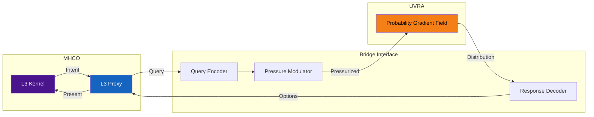
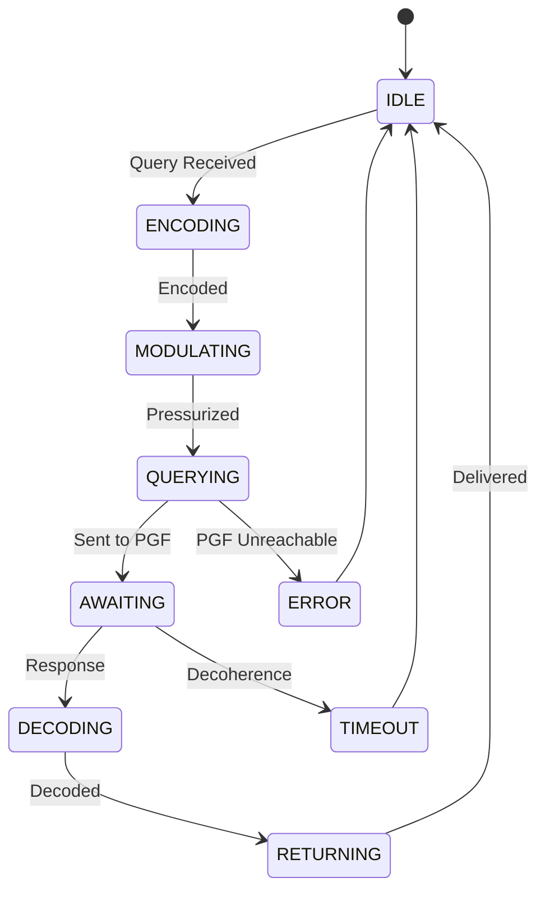

# 01: Bridge Interface

> **Status: Terminal Artifact (v2.0.0)**

---

## Definition

The Bridge Interface connects the MHCO L3 Proxy to the UVRA Probability Gradient Field. It handles query encoding, pressure modulation, and response decoding.

---

## L3 Proxy Specification

The L3 Proxy is the **interface layer**, not the selector.

| Component | Authority |
|-----------|-----------|
| L3 Kernel | Selection (OR) |
| L3 Proxy | Query/Response handling |

L3 Proxy translates intent into queries. Only L3 Kernel performs Selection.

---

## Query Pressure Model

**Query Pressure** ($P_q$) determines distribution width:

$$P_q = \frac{\partial \Psi}{\partial t} \cdot \nabla_{\vec{v}} \phi$$

| Regime | $P_q$ | Characteristic |
|--------|-------|----------------|
| Diffuse | $< 0.3$ | Wide distribution |
| Focused | $0.3 - 0.7$ | Balanced |
| Acute | $> 0.7$ | Narrow distribution |

---

## Query Protocol

### Phase 1: Intent Encoding

$$\vec{I} = \sum_{i=1}^{n} \alpha_i |e_i\rangle$$

### Phase 2: Pressure Modulation

$$\vec{I}' = \mathcal{P}(P_q) \cdot \vec{I}$$

$$\mathcal{P}(P_q) = e^{-\beta(1-P_q)\hat{H}}$$

### Phase 3: PGF Interaction

$$\rho(\vec{x}) = |\langle\vec{x}|\vec{I}'\rangle|^2 \cdot G(\vec{x})$$

---

## State Machine

---

## Query Types

| Type | Function |
|------|----------|
| `QUERY_EXIST` | Existence probability |
| `QUERY_GRADIENT` | Local gradient direction |
| `QUERY_SUPER` | Full distribution over subspace |
| `QUERY_CORRELATE` | Correlation coefficients |

---

## Constraints

1. **L3 Proxy exclusivity.** L2 Shell uses External Bus.
2. **Pressure bounds:** $P_q \in [0, 1]$.
3. **No caching.** Each query is fresh.
4. **Query ≠ Selection.** Bridge retrieves; Kernel selects.

---

## Error Codes

| Code | Condition |
|------|-----------|
| `BI_E001` | Coherence lost |
| `BI_E002` | Pressure overflow |
| `BI_E003` | PGF unreachable |
| `BI_E004` | Timeout |
| `BI_E006` | L2 Shell direct access |

---

*UVCS Architecture 01 — Bridge Interface v2.0.0*
