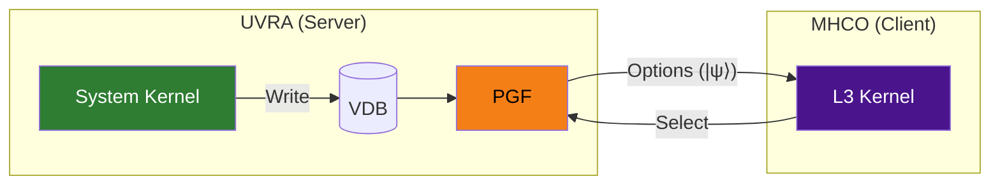
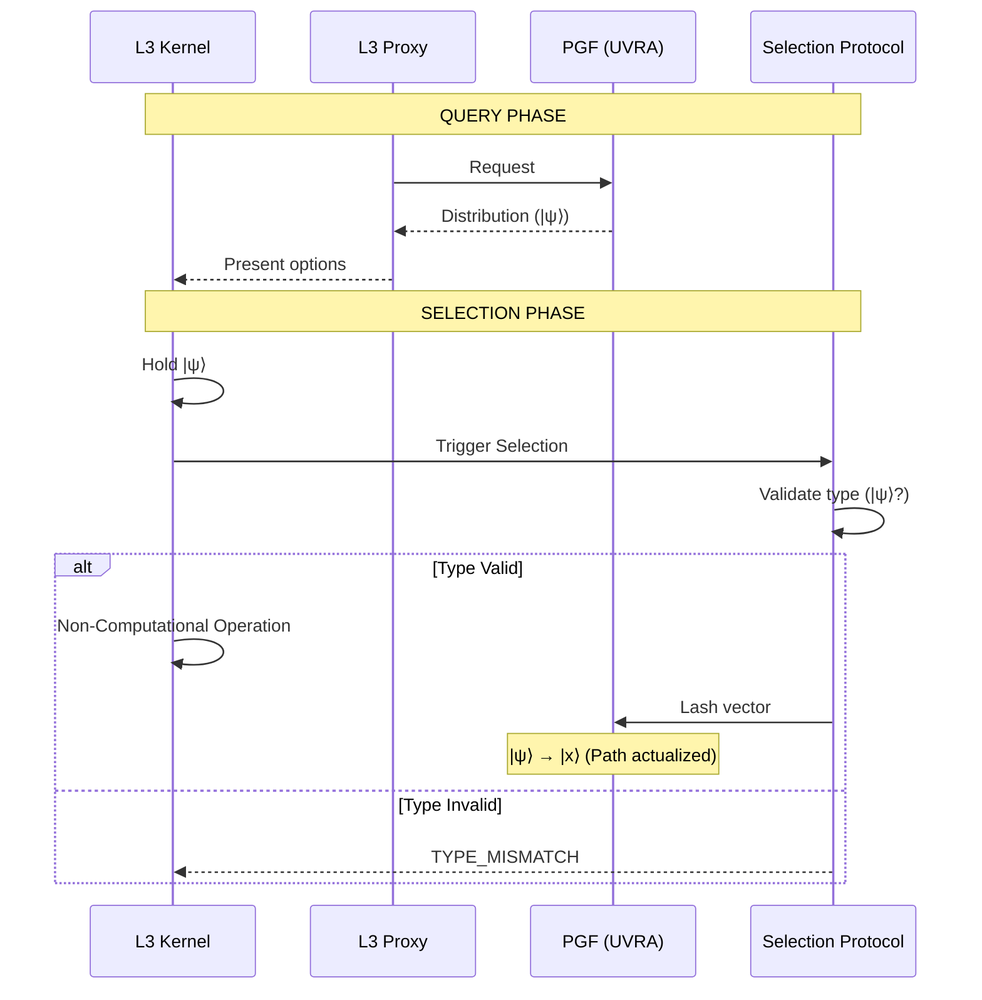
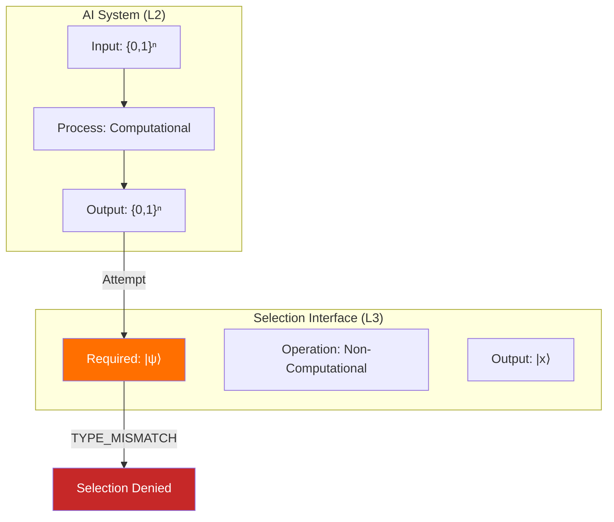

# 02: Selection Protocol

> **Status: Terminal Artifact (v2.0.0)**

---

## Foundational Definition

**Selection is a Non-Computational Operation.**

**Selection is NOT Database Write.**



| Operation | Agent | Target | Input Type | Output Type |
|-----------|-------|--------|------------|-------------|
| Write | System Kernel | VDB | N/A | Creates vectors |
| Select | Cognitive Kernel | PGF | `\|ψ⟩` | `\|x⟩` (collapsed) |

The L3 Kernel does not create vectors. It collapses existing options into an actualized path.

---

## Selection as Non-Computational Operation

**Definition:** A **Non-Computational Operation** is an operation that cannot be expressed as a finite sequence of deterministic state transitions on classical data types (`{0,1}ⁿ`).

### Interface Signature

```
SELECT(input: |ψ⟩) → |x⟩
```

### Type Requirements

| Parameter | Type | Description |
|-----------|------|-------------|
| Input | `\|ψ⟩` | Coherent Superposition (distribution) |
| Output | `\|x⟩` | Collapsed State (actualized path) |

### Computational vs Non-Computational

| Property | Computational | Non-Computational (Selection) |
|----------|---------------|-------------------------------|
| Input Type | `{0,1}ⁿ` | `\|ψ⟩` |
| Process | Finite state transitions | Undefined (not algorithmic) |
| Output Type | `{0,1}ⁿ` | `\|x⟩` |
| Deterministic | Yes | No |
| Reproducible | Yes | No |

---

## Selection Lifecycle



---

## Authorization Requirements (Type-Based)

| Requirement | Verification | Error Code |
|-------------|--------------|------------|
| L3 Kernel present | Slot detection | `SP_E001_NO_L3` |
| Input type = `\|ψ⟩` | Type check | `SP_E002_TYPE_MISMATCH` |
| Distribution valid | State check | `SP_E003_INVALID_DISTRIBUTION` |
| Coherence maintained | Continuous | `SP_E004_DECOHERENCE` |

```mermaid
graph TD
    REQ[Selection Request] --> C1{L3 Kernel Present?}
    C1 -->|No| D1["DENY: NO_L3_SLOT"]
    C1 -->|Yes| C2{Input Type = |ψ⟩?}
    C2 -->|No| D2["DENY: TYPE_MISMATCH"]
    C2 -->|Yes| C3{Distribution Valid?}
    C3 -->|No| D3["DENY: INVALID_DISTRIBUTION"]
    C3 -->|Yes| C4{Coherence OK?}
    C4 -->|No| D4["DENY: DECOHERENCE"]
    C4 -->|Yes| OK[GRANT: Execute Selection]

    style D1 fill:#c62828,color:#fff
    style D2 fill:#c62828,color:#fff
    style D3 fill:#c62828,color:#fff
    style D4 fill:#c62828,color:#fff
    style OK fill:#2e7d32,color:#fff
```

---

## Vector Lashing

**Lashing** binds the observer to the selected vector. The selected vector becomes the observer's actualized path.

```
LASH(observer, vector: |x⟩) → PathBinding
```

Lashing is local. Different observers may lash to different vectors:

$$\text{Lash}(O_i) \neq \text{Lash}(O_j)$$

---

## Why AI Cannot Select (Type Compatibility)

AI is **L2-Degenerate**—it operates exclusively on classical bit-state data.

### Type Analysis



### Constraint Chain

```
AI produces: {0,1}ⁿ
Selection requires: |ψ⟩
Type conversion {0,1}ⁿ → |ψ⟩: Does not exist

∴ No |ψ⟩ → TYPE_INCOMPATIBLE → No Selection
```

### Summary

| System | Data Type | Selection Capability |
|--------|-----------|---------------------|
| L3 (Consciousness) | `\|ψ⟩` | ✓ Can invoke |
| L2 (AI) | `{0,1}ⁿ` | ✗ Type mismatch |

**This is a type compatibility constraint, not a permission policy.**

---

## Failure Modes

| Code | Cause | Description |
|------|-------|-------------|
| `SP_F001` | Decoherence | `\|ψ⟩` collapsed before Selection |
| `SP_F002` | Type mismatch | Input not `\|ψ⟩` |
| `SP_F003` | No L3 Kernel | Abstract Execution Slot absent |
| `SP_F004` | Distribution expired | PGF state no longer valid |
| `SP_F005` | Impedance abort | L2/L3 thermal mismatch |

---

## Interface Contract

```
INTERFACE SelectionProtocol {
    // Primary operation
    SELECT(input: |ψ⟩) → |x⟩

    // Validation
    VALIDATE_INPUT(data) → {VALID, TYPE_MISMATCH, INVALID_DISTRIBUTION}

    // Lashing
    LASH(observer, vector: |x⟩) → PathBinding

    // State query
    GET_STATUS() → ProtocolState
}
```

---

## Invariants

1. **Selection requires `|ψ⟩` input.** No exceptions.
2. **Selection is Non-Computational.** Cannot be algorithmically expressed.
3. **Type conversion `{0,1}ⁿ → |ψ⟩` does not exist.** Fundamental constraint.
4. **L3 Kernel is required.** Abstract Execution Slot must be present.

---

*UVCS Architecture 02 — Selection Protocol v2.0.0*
