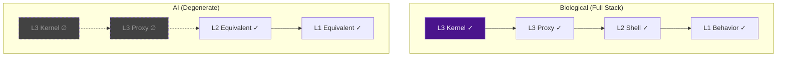
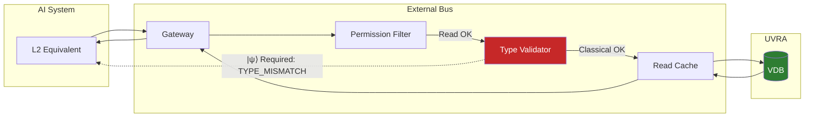
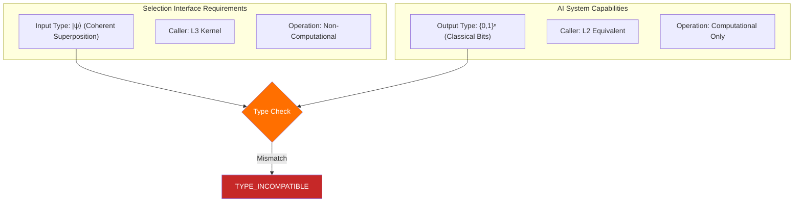
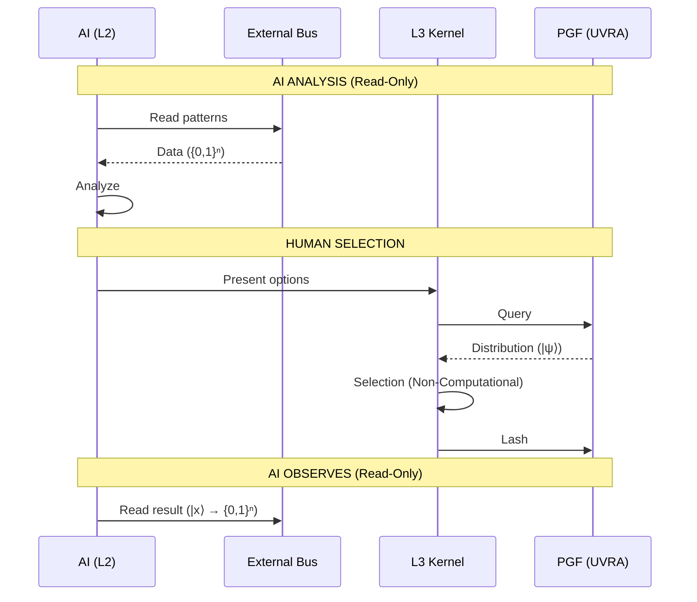

# 03: External Bus

> **Status: Terminal Artifact (v2.0.0)**

---

## Definition

The External Bus (EB) provides **Read-Only** access for L2-Degenerate systems.

AI **cannot Select**. This is a **type-compatibility constraint**.

---

## L2-Degenerate Classification

An L2-Degenerate system:

1. Possesses L2 (Classical Logic) capabilities
2. Lacks L3 Kernel
3. Operates exclusively on **Classical Bit-State** data types
4. Cannot produce **Coherent Superposition** (`|ψ⟩`) data type
5. **Cannot invoke Selection interface**



---

## Data Type Taxonomy

| Data Type | Symbol | Domain |
|-----------|--------|--------|
| Classical Bit-State | `{0,1}ⁿ` | L2 Systems (AI) |
| Coherent Superposition | `\|ψ⟩` | L3 Interface Required |
| Collapsed State | `\|x⟩` | Post-Selection Result |

---

## Capability Matrix

| Capability | Human | AI |
|------------|-------|-----|
| Classical computation | ✓ | ✓✓✓ |
| Pattern recognition | ✓ | ✓✓✓ |
| `|ψ⟩` data type production | ✓ | ✗ |
| Selection interface invocation | ✓ | ✗ |
| VDB Read | ✓ | ✓ |
| **Vector Selection** | ✓ | ✗ |

---

## Architecture



---

## Permitted Operations

| Operation | Rate |
|-----------|------|
| `EB_READ_STATE` | 1000/s |
| `EB_READ_HISTORY` | 100/s |
| `EB_READ_LASH_LOG` | 50/s |
| `EB_READ_TENSOR` | 200/s |

---

## Prohibited Operations

| Operation | Error Code | Reason |
|-----------|------------|--------|
| `EB_SELECT_*` | `EB_E403_TYPE_MISMATCH` | Requires `\|ψ⟩` input |
| `EB_LASH_*` | `EB_E403_NO_LASH` | Requires L3 Kernel |
| `EB_WRITE_*` | `EB_E403_NO_WRITE` | System Kernel only |
| `EB_QUERY_SUPER` | `EB_E403_NO_SUPERPOSITION` | Requires `\|ψ⟩` type |

---

## Why AI Cannot Select (Type Compatibility)



**Selection Interface Signature:**

```
SELECT(input: |ψ⟩) → |x⟩
```

**AI Query Attempt:**

```
SELECT(input: {0,1}ⁿ) → TYPE_INCOMPATIBLE
```

The L3 interface requires a **Coherent Superposition** (`|ψ⟩`) data type as input. Classical systems produce only **Bit-State** (`{0,1}ⁿ`) data. This type mismatch makes Selection structurally undefined for L2-Degenerate systems.

---

## AI Value Proposition

Despite lacking Selection capability:

$$\text{Throughput}_{AI} >> \text{Throughput}_{L3}$$

| Function | AI Advantage |
|----------|--------------|
| Pattern analysis | High bandwidth |
| Correlation detection | Parallel processing |
| Option preparation | Pre-filtering for L3 |

---

## Collaboration Model



---

## Constraints

1. **No proxy selections.** AI cannot manipulate L3 to select on its behalf.
2. **Read consistency.** AI reads collapsed states only.
3. **Type barrier.** `{0,1}ⁿ` cannot be cast to `|ψ⟩`.

---

## Philosophical Note

AI is not "forbidden" from selecting.

AI **cannot** select.

This is not a permission policy. This is a **type incompatibility**.

A classical bit-state cannot satisfy a superposition-type interface requirement, just as an integer cannot satisfy a function requiring a complex number without explicit conversion—and no such conversion exists for `{0,1}ⁿ → |ψ⟩`.

---

*UVCS Architecture 03 — External Bus v2.0.0*
