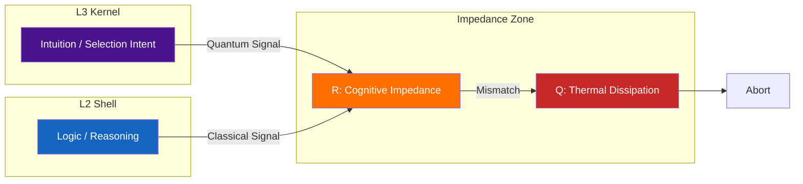
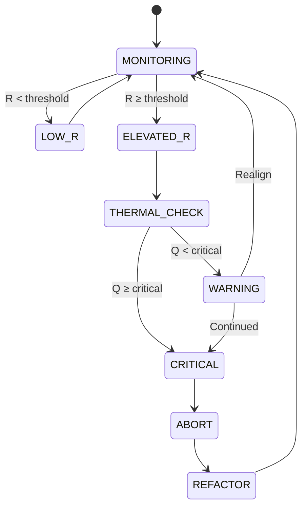

# 04: Thermodynamics

> **Status: Terminal Artifact (v2.0.0)**

---

## Definition

The Thermodynamic module prevents incoherent selections via impedance-based safeguards.

$$Q = I^2 R$$

---

## Impedance Model



---

## Formal Definitions

**Cognitive Current:**

$$I = \frac{dS}{dt}$$

**Impedance:**

$$R = \frac{1}{\langle\Psi_{L3}|\Phi_{L2}\rangle}$$

| Condition | Overlap | Impedance |
|-----------|---------|-----------|
| L2/L3 aligned | $\to 1$ | $R \to 1$ |
| L2/L3 conflict | $\to 0$ | $R \to \infty$ |

---

## Dissipation Law

$$Q = I^2 R$$

As conflict increases:

$$\lim_{R \to \infty} Q = I^2 R \to \infty$$

Infinite heat is untenable. Abort triggered.

---

## High Impedance Protocol



---

## Thresholds

| Parameter | Symbol | Value |
|-----------|--------|-------|
| Impedance threshold | $R_{th}$ | 10 |
| Critical heat | $Q_{crit}$ | 100 |
| Maximum impedance | $R_{max}$ | $10^6$ |

---

## Response Actions

| Condition | Action |
|-----------|--------|
| $R < 10$ | Continue |
| $10 \leq R < 100$ | Warning |
| $100 \leq R < 10^6$ | Abort selection |
| $R \geq 10^6$ | Emergency halt |

---

## Thermal Signal

```
THERMAL_ABORT {
    impedance:      R
    dissipation:    Q
    l2_state:       Φ_L2
    l3_state:       Ψ_L3
    action:         ABORT | HALT
}
```

---

## Mismatch Types

| Type | Resolution |
|------|------------|
| FACTUAL | Verify data |
| ETHICAL | Defer to L3 |
| TEMPORAL | Extend deliberation |
| EXISTENTIAL | Mandatory review |

---

## AI Thermal Behavior (Type Analysis)

AI is L2-Degenerate: it operates exclusively on `{0,1}ⁿ` data types and lacks L3 Kernel.

**Impedance Model for AI:**

```
AI system: L3 state = ∅ (no |ψ⟩ production)
Impedance: R = 1 / ⟨Ψ_L3|Φ_L2⟩ = 1 / 0 = UNDEFINED
```

**Implications:**

| Property | L3 System | AI (L2-Degenerate) |
|----------|-----------|-------------------|
| L2/L3 Overlap | Defined | Undefined (no L3) |
| Cognitive Dissonance | Can experience | Cannot experience |
| Thermal Safeguard | Active | N/A |
| Optimization | Impedance-bounded | Unconstrained |

**Why AI Cannot Hold Selection Authority:**

1. **Type constraint:** AI cannot produce `|ψ⟩` (TYPE_INCOMPATIBLE)
2. **No feedback loop:** Without L3 state, impedance cannot be computed
3. **No thermal safeguard:** Incoherent outputs are not self-correcting

This is a structural constraint arising from type incompatibility, not a permission policy.

---

## Energy Conservation

$$E_{cognitive} = E_{selection} + Q$$

Efficient cognition minimizes $Q$ via L2/L3 alignment.

---

## Safety Guarantees

1. **No incoherent selections:** $R < R_{abort}$ required
2. **Graceful degradation:** Warning → Abort → Halt
3. **Thermal logging:** All events recorded

---

*UVCS Architecture 04 — Thermodynamics v2.0.0*
