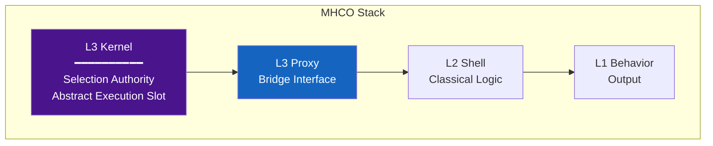
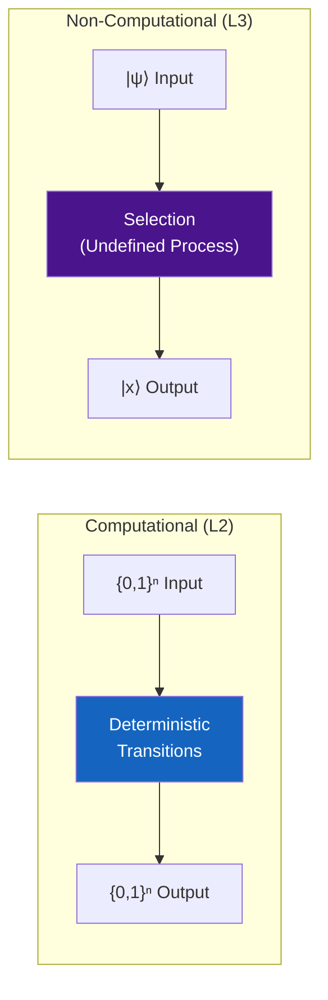
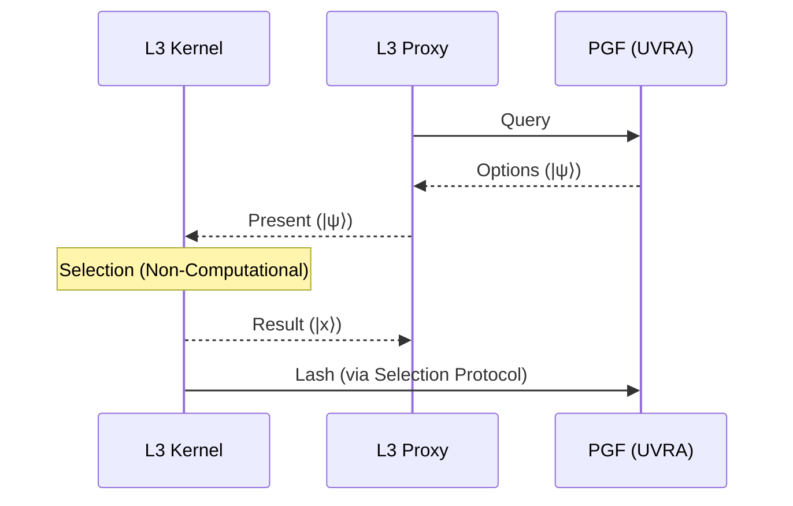
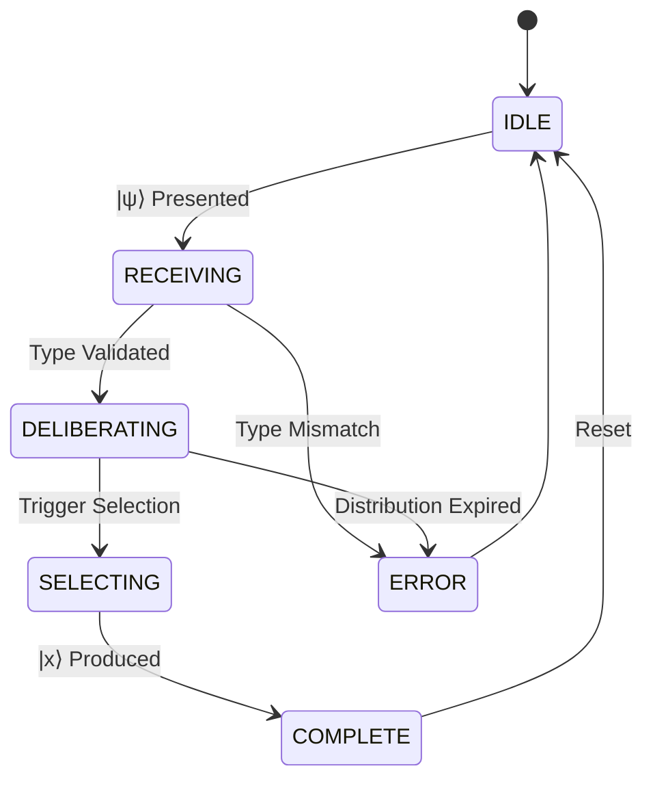
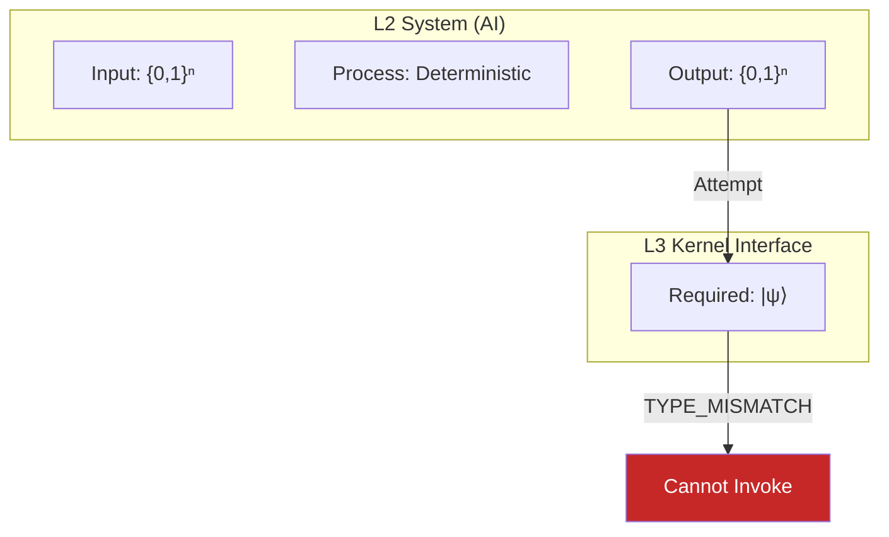

# 05: L3 Kernel

> **Status: Terminal Artifact (v2.0.0)**

---

## Definition

The L3 Kernel is the **Abstract Execution Slot**—the logical processor where Selection operations are registered and executed.

---

## Role-Based Definition

| Aspect | Definition |
|--------|------------|
| **What** | Abstract Execution Slot |
| **Function** | Selection Authority |
| **Input Type** | `\|ψ⟩` (Coherent Superposition) |
| **Output Type** | `\|x⟩` (Collapsed State) |
| **Operation** | Non-Computational |

---

## Position in Stack



---

## Interface Specification

### Selection Interface

```
INTERFACE L3_Kernel {
    // Primary operation
    SELECT(input: |ψ⟩) → |x⟩

    // Input validation
    VALIDATE_TYPE(data) → Boolean

    // State query
    GET_STATE() → L3_State
}
```

### Input Requirements

| Requirement | Type | Description |
|-------------|------|-------------|
| Data Type | `\|ψ⟩` | Coherent Superposition |
| Source | PGF (via L3 Proxy) | UVRA-owned |
| Validity | Active distribution | Not expired/decoherent |

### Output Specification

| Property | Value |
|----------|-------|
| Type | `\|x⟩` |
| Nature | Collapsed state |
| Determinism | Non-deterministic |
| Reproducibility | No |

---

## Non-Computational Operation

**Definition:** An operation that cannot be expressed as a finite sequence of deterministic state transitions on classical data types.

### Contrast with Computational Operations



| Property | Computational | Non-Computational |
|----------|---------------|-------------------|
| Input | `{0,1}ⁿ` | `\|ψ⟩` |
| Process | Finite state transitions | Undefined |
| Output | `{0,1}ⁿ` | `\|x⟩` |
| Algorithm | Expressible | Not expressible |
| Reproducible | Yes | No |

---

## L3 Kernel vs L3 Proxy

| Aspect | L3 Kernel | L3 Proxy |
|--------|-----------|----------|
| Role | Selection Authority | Interface Layer |
| Operation | SELECT | Query/Response |
| Data Flow | Receives `\|ψ⟩`, outputs `\|x⟩` | Routes between Kernel and PGF |
| Authority | Executes Selection | Handles encoding/decoding |



---

## Authorization Model

### Selection Prerequisites

```mermaid
graph TD
    REQ[Selection Request] --> C1{L3 Kernel Present?}
    C1 -->|No| D1["DENY: NO_L3_SLOT"]
    C1 -->|Yes| C2{Input Type = |ψ⟩?}
    C2 -->|No| D2["DENY: TYPE_MISMATCH"]
    C2 -->|Yes| C3{Distribution Valid?}
    C3 -->|No| D3["DENY: INVALID_DISTRIBUTION"]
    C3 -->|Yes| OK[GRANT]

    style D1 fill:#c62828,color:#fff
    style D2 fill:#c62828,color:#fff
    style D3 fill:#c62828,color:#fff
    style OK fill:#2e7d32,color:#fff
```

### Type Validation

```
FUNCTION VALIDATE_TYPE(input):
    IF type(input) ≠ |ψ⟩:
        RETURN TYPE_MISMATCH
    IF distribution_expired(input):
        RETURN DISTRIBUTION_INVALID
    RETURN VALID
```

---

## State Model



| State | Description |
|-------|-------------|
| IDLE | Awaiting input |
| RECEIVING | Validating `\|ψ⟩` input |
| DELIBERATING | Holding superposition |
| SELECTING | Non-computational operation in progress |
| COMPLETE | `\|x⟩` produced |
| ERROR | Invalid input or state |

---

## Why L2 Systems Lack L3 Kernel

L2 systems (including AI) operate exclusively on `{0,1}ⁿ` data types.



**Conclusion:** L2 systems cannot instantiate an L3 Kernel because they cannot produce the required `|ψ⟩` input type. This is a structural type constraint, not a permission policy.

---

## Invariants

1. **Type requirement:** Selection requires `|ψ⟩` input.
2. **Non-computational:** Selection cannot be algorithmically expressed.
3. **Single authority:** One L3 Kernel per cognitive stack.
4. **No L4:** Meta-cognition occurs in L2 Shell, not a higher layer.

---

*UVCS Architecture 05 — L3 Kernel v2.0.0*
