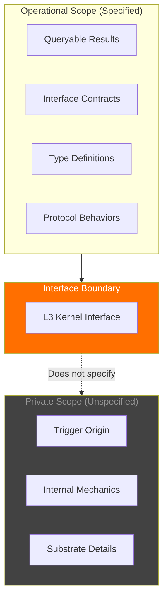
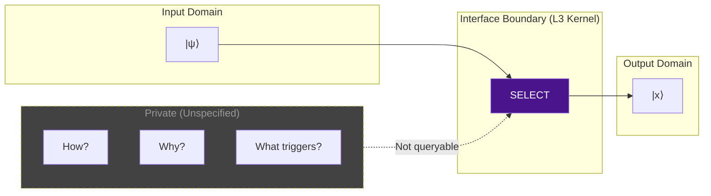

# 06: System Hidden (Interface Boundary)

> **Status: Terminal Artifact (v2.0.0)**

---

## Definition

This document defines the **Interface Boundary** of the UVCS framework—the explicit demarcation between what the framework specifies (Operational Scope) and what it treats as external preconditions (Private Scope).

---

## Scope Classification



---

## Operational Scope (What UVCS Specifies)

The framework defines:

| Element | Specification |
|---------|---------------|
| **Input Type** | `\|ψ⟩` (Coherent Superposition) |
| **Output Type** | `\|x⟩` (Collapsed State) |
| **Operation Name** | Selection |
| **Operation Class** | Non-Computational |
| **Interface Signature** | `SELECT(|ψ⟩) → \|x⟩` |
| **Result** | Lash (path actualization) |

### Queryable Interface Results

```
INTERFACE QueryableResults {
    // What can be observed via the interface
    GET_SELECTION_RESULT() → |x⟩
    GET_LASH_LOG() → LashRecord[]
    GET_DISTRIBUTION_STATE() → DistributionStatus
}
```

---

## Private Scope (What UVCS Does Not Specify)

The framework explicitly **does not define**:

| Element | Status | Rationale |
|---------|--------|-----------|
| **Trigger Origin** | Out-of-scope | System precondition |
| **Internal Mechanics** | Out-of-scope | Implementation detail |
| **How `\|ψ⟩` is produced** | Out-of-scope | Substrate-dependent |
| **Physical constants** | Out-of-scope | Implementation-specific |
| **Measurement methodology** | Out-of-scope | Not an interface concern |

---

## Interface Boundary Principle



**Principle:** The framework specifies **what** the interface accepts and returns, not **how** or **why** the transformation occurs.

---

## Trigger Origin: Out-of-Scope Precondition

### What We Specify

- Selection **requires** L3 Kernel
- Selection **requires** `|ψ⟩` input type
- Selection **produces** `|x⟩` output type
- Selection is **Non-Computational**

### What We Do Not Specify

- What **causes** L3 Kernel to exist
- What **mechanism** produces `|ψ⟩`
- What **process** converts `|ψ⟩` to `|x⟩`
- **Why** Selection occurs

```
// This is specified
INTERFACE L3_Kernel {
    SELECT(input: |ψ⟩) → |x⟩
}

// This is NOT specified
IMPLEMENTATION L3_Kernel {
    // Internal mechanics are private
    // Trigger origin is a precondition
    // Substrate details are out-of-scope
}
```

---

## Rationale for Interface Boundary

### 1. Implementation Agnosticism

The framework must remain valid regardless of:
- Physical substrate (biological, quantum, hypothetical)
- Specific constants or measurements
- Implementation technology

### 2. Avoiding Circular Definitions

By treating Trigger Origin as a precondition:
- We avoid defining consciousness in terms of itself
- Selection is defined by **type signature**, not by **causation**
- The framework remains logically consistent

### 3. Focus on Queryable Results

The framework is concerned with:
- What can be **observed** via the interface
- What **types** flow through the system
- What **constraints** apply to operations

Not with:
- Metaphysical questions about consciousness
- Physical implementation details
- Measurement methodologies

---

## Contrast: Interface vs Ontology

| Aspect | Interface Specification | Ontological Claim |
|--------|------------------------|-------------------|
| Focus | Type signatures | Nature of reality |
| Question | "What types?" | "What is?" |
| Scope | Queryable | All |
| UVCS Position | ✓ Specified | ✗ Out-of-scope |

**UVCS is an Interface Specification, not an Ontological Framework.**

---

## Practical Implications

### For Implementers

- Treat the interface contract as binding
- Internal implementation is unconstrained by this spec
- Type requirements are mandatory

### For Consumers

- Query only what the interface exposes
- Do not assume internal mechanics
- Respect type constraints

### For Theorists

- The framework does not answer "why consciousness exists"
- It specifies "how consciousness interfaces with the system"
- Ontological questions are out-of-scope

---

## Summary

| Scope | Contents | Specified? |
|-------|----------|------------|
| Operational | Interface contracts, type definitions, protocols | ✓ Yes |
| Private | Trigger origin, internal mechanics, substrate | ✗ No |

**The Interface Boundary separates what UVCS defines from what it treats as external preconditions.**

---

*UVCS Architecture 06 — System Hidden v2.0.0*
