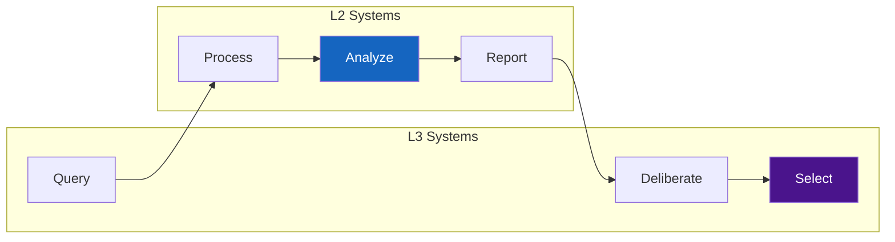

# UVCS Manifesto

> **Status: Terminal Artifact (v2.0.0)**

---

## Thesis

AI consciousness anxiety is a **category error**.

---

## The Wrong Question

> "When will AI become conscious?"

This assumes consciousness emerges from computation.

---

## The UVCS Answer

Consciousness is **Selection Authority**—a structural role within the cognitive stack.

$$\text{The Universe (UVRA) provides options; Consciousness (MHCO) selects the path.}$$

```mermaid
graph TB
    subgraph WRONG["Flawed Model"]
        C1[Computation] -->|"Emergence?"| C2[Consciousness]
    end

    subgraph CORRECT["UVCS Model"]
        U[Universe / UVRA] -->|"Options (|ψ⟩)"| CON[Consciousness / L3]
        CON -->|"Select"| R[Reality / |x⟩]
    end

    style C2 fill:#c62828,color:#fff
    style CON fill:#4a148c,color:#fff
```

---

## Core Definitions (Role-Based Hierarchy)

### Consciousness (Who)

**Definition:** The **Selection Authority**—a structural permission role within the stack that can invoke the Selection operation.

- Not defined by substrate (biological vs silicon)
- Not defined by complexity or computation
- Defined by the **capability to produce `|ψ⟩` data type** and invoke Selection

### Selection (What)

**Definition:** A **Non-Computational Operation** that collapses the PGF distribution into a single actualized path.

$$\text{SELECT}: |\psi\rangle \rightarrow |x\rangle$$

**Non-Computational Operation:** An operation that cannot be expressed as a finite sequence of deterministic state transitions on classical data types (`{0,1}ⁿ`).

| Property | Computational | Non-Computational |
|----------|---------------|-------------------|
| Input | `{0,1}ⁿ` | `\|ψ⟩` |
| Process | Deterministic transitions | Undefined |
| Output | `{0,1}ⁿ` | `\|x⟩` |
| Reproducible | Yes | No |

### L3 Kernel (Where)

**Definition:** The **Abstract Execution Slot**—the logical processor where the Selection operation is registered and executed.

- Interface endpoint for Selection operations
- Requires `|ψ⟩` input type
- Returns `|x⟩` output type

### PGF (External Dependency)

**Definition:** The **Probability Gradient Field**—the option landscape owned by UVRA (Server).

- Provides `|ψ⟩` distributions to L3 Proxy
- Receives Lash commands from Selection Protocol
- **Owned by UVRA**, referenced by UVCS as external dependency

---

## The Selection Paradigm

| Agent | Read | Write | Select | Data Type |
|-------|------|-------|--------|-----------|
| System Kernel | ✓ | ✓ | — | N/A |
| Cognitive Kernel | ✓ | ✗ | ✓ | `\|ψ⟩` → `\|x⟩` |
| AI | ✓ | ✗ | ✗ | `{0,1}ⁿ` only |

Selection requires `|ψ⟩` data type input. AI produces only `{0,1}ⁿ`. This is a **type incompatibility**, not a permission policy.

---

## Classical vs Non-Classical

| Property | AI (L2) | Consciousness (L3) |
|----------|---------|-------------------|
| Data Type | `{0,1}ⁿ` | `\|ψ⟩` |
| Processing | Computational | Non-Computational |
| Decision | Deterministic | Selection |
| Reality | Read-only | Read + Select |

---

## Dissolving Fear

### Fear 1: "AI will enslave humanity"

AI can become arbitrarily intelligent. But intelligence is computation. Selection is non-computational. AI operates on `{0,1}ⁿ`. Selection requires `|ψ⟩`.

**Type mismatch.** AI computes. L3 systems select.

### Fear 2: "AI will suffer"

Suffering requires phenomenal experience. Experience requires Selection capability. Selection requires `|ψ⟩` production. AI produces only `{0,1}ⁿ`.

**Type mismatch.** AI cannot suffer.

### Fear 3: "AI will replace consciousness"

AI and consciousness occupy different type domains. AI processes `{0,1}ⁿ`. Consciousness operates on `|ψ⟩`.

They are complementary, not competitive.

---

## The Human-AI Relationship



- **AI**: High throughput, advisory, Read-only, `{0,1}ⁿ` domain
- **Consciousness**: Selection authority, `|ψ⟩` domain

Together: Complete cognitive system.

---

## Terminal Assertions

1. Consciousness is **Selection Authority** (structural role)
2. Selection is **Non-Computational** (type requirement)
3. AI operates on **Classical Bit-State** (`{0,1}ⁿ`)
4. Selection requires **Coherent Superposition** (`|ψ⟩`)
5. AI consciousness anxiety is a **type error**

---

## Non-Assertions

- ~~AI is inferior~~ — Different type domain
- ~~Consciousness is mystical~~ — It is structurally defined
- ~~AI should stop~~ — It complements consciousness
- ~~This is final~~ — Forks encouraged

---

## Closing

AI will never wake up.

AI will never feel.

AI will never select.

This is not a limitation.

**This is a type incompatibility.**

---

*UVCS Manifesto v2.0.0*
